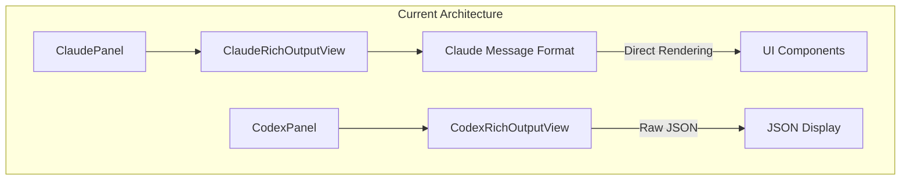
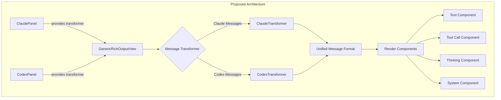
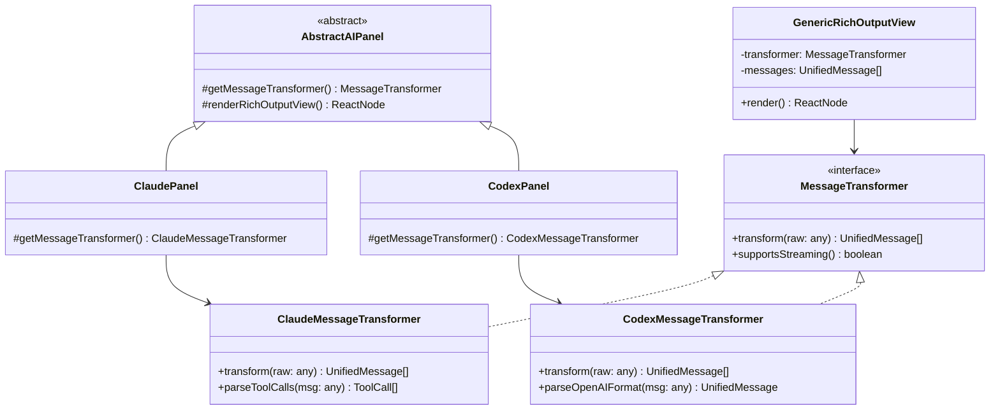
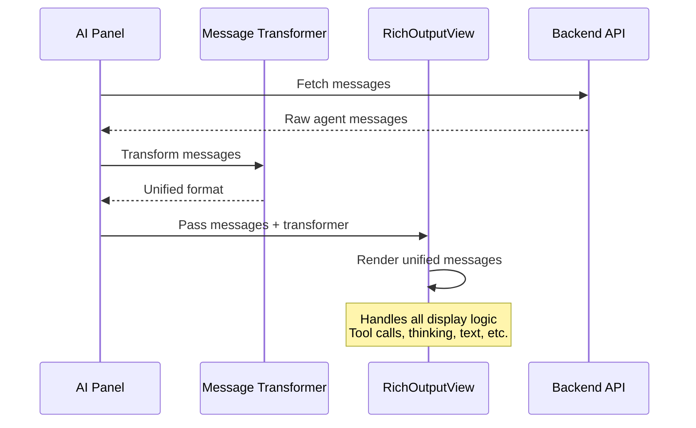
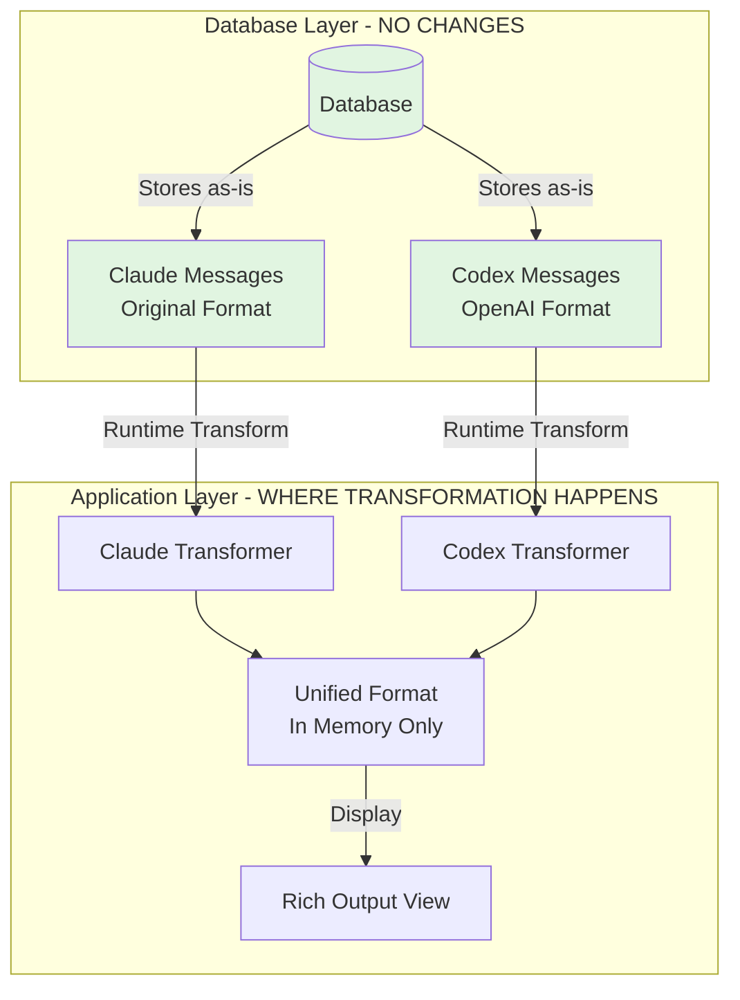

# Rich Output View Abstraction Plan

## Overview
This document outlines the plan to abstract the RichOutputView component to be generic and reusable across different AI agent panels (Claude, Codex, and future agents), allowing all panels to share the same rich message rendering capabilities.

## Goals
- **Unify message rendering** across all AI agent panels
- **Maintain exact functionality** for existing Claude panel
- **Zero database changes** - all transformation happens at display time
- **Enable Codex** to use the same rich output view as Claude
- **Create extensible architecture** for future AI agents

## Current State

### Problem
- ClaudePanel has a sophisticated RichOutputView that renders messages beautifully
- CodexPanel shows raw JSON output
- Code duplication if we want similar rendering for multiple agents
- Each agent has different message formats (Claude format vs OpenAI format)

### Current Architecture


## Proposed Solution

### New Architecture


### Class Hierarchy


## Implementation Details

### 1. Unified Message Format
```typescript
// Unified message structure that all agents transform to
interface UnifiedMessage {
  id: string;
  role: 'user' | 'assistant' | 'system';
  timestamp: string;
  segments: MessageSegment[];
  metadata?: {
    agent?: string;
    model?: string;
    duration?: number;
    tokens?: number;
    cost?: number;
    [key: string]: any;
  };
}

type MessageSegment = 
  | { type: 'text'; content: string }
  | { type: 'tool_call'; tool: ToolCall }
  | { type: 'system_info'; info: any }
  | { type: 'thinking'; content: string };

interface ToolCall {
  id: string;
  name: string;
  input?: any;
  result?: ToolResult;
  status: 'pending' | 'success' | 'error';
  isSubAgent?: boolean;
  [key: string]: any;
}
```

### 2. Message Transformer Interface
```typescript
interface MessageTransformer {
  // Transform raw agent messages to unified format
  transform(rawMessages: any[]): UnifiedMessage[];
  
  // Parse a single message
  parseMessage(raw: any): UnifiedMessage | null;
  
  // Agent-specific capabilities
  supportsStreaming(): boolean;
  supportsThinking(): boolean;
  supportsToolCalls(): boolean;
}
```

### 3. Data Flow


## Database Considerations

### No Database Changes Required! ✅



**Key Points:**
- Database continues to store messages in their original format
- Transformation happens at display time only
- Unified format exists only in memory
- No migrations needed
- Easy rollback if needed

## File Structure

```
frontend/src/components/panels/
├── ai/
│   ├── AbstractAIPanel.tsx (already created)
│   ├── RichOutputView.tsx (NEW - generic version)
│   ├── transformers/
│   │   ├── MessageTransformer.ts (NEW - interface)
│   │   ├── ClaudeMessageTransformer.ts (NEW)
│   │   └── CodexMessageTransformer.ts (NEW)
│   └── components/
│       ├── MessageSegment.tsx (NEW - renders segments)
│       ├── ToolCallView.tsx (NEW - extracted from current)
│       └── ThinkingView.tsx (NEW - extracted from current)
├── claude/
│   ├── ClaudePanel.tsx (updated to use generic)
│   ├── RichOutputView.tsx (DEPRECATED - will remove)
│   └── ...
└── codex/
    ├── CodexPanel.tsx (updated to use generic)
    ├── CodexRichOutputView.tsx (DEPRECATED - will remove)
    └── ...
```

## Implementation Steps

### Phase 1: Create Core Components
1. Create `MessageTransformer` interface
2. Create generic `RichOutputView` component in `ai/` folder
3. Extract reusable UI components (ToolCallView, ThinkingView, etc.)
4. Update `AbstractAIPanel` to include transformer method

### Phase 2: Create Transformers
1. Implement `ClaudeMessageTransformer`
   - Parse Claude's tool_use/tool_result format
   - Handle thinking blocks
   - Extract system messages
   
2. Implement `CodexMessageTransformer`
   - Parse OpenAI role/content format
   - Map function_call to tool format
   - Handle streaming tokens

### Phase 3: Update Panels
1. Update ClaudePanel
   - Implement `getMessageTransformer()`
   - Switch to generic RichOutputView
   - Verify identical behavior
   
2. Update CodexPanel
   - Implement `getMessageTransformer()`
   - Replace raw JSON view with RichOutputView
   - Test with real Codex messages

### Phase 4: Testing & Validation
1. Verify Claude panel works identically to before
2. Test Codex panel with various message types
3. Check performance with large message histories
4. Validate all interactive features (collapse/expand, etc.)

## Success Criteria

- [ ] Claude panel continues to work exactly as before
- [ ] Codex panel shows rich formatted output instead of JSON
- [ ] No database changes required
- [ ] Code duplication reduced
- [ ] Easy to add new AI agents in the future
- [ ] All existing features preserved:
  - [ ] Tool call rendering
  - [ ] Thinking blocks
  - [ ] Collapse/expand
  - [ ] Timestamp display
  - [ ] System messages
  - [ ] Markdown rendering
  - [ ] Syntax highlighting

## Risks & Mitigations

| Risk | Mitigation |
|------|------------|
| Breaking Claude panel | Extensive testing, feature flags for rollout |
| Performance issues | Memoization, lazy loading, virtual scrolling |
| Unknown message formats | Fallback to raw display, logging for debugging |
| Complex transformation logic | Comprehensive unit tests for transformers |

## Example Transformations

### Claude Message → Unified Format
```javascript
// Input (Claude format)
{
  type: 'tool_use',
  id: 'tool_123',
  name: 'Edit',
  input: { file: 'test.js', old: 'foo', new: 'bar' }
}

// Output (Unified format)
{
  id: 'msg_123',
  role: 'assistant',
  timestamp: '2024-01-01T12:00:00Z',
  segments: [{
    type: 'tool_call',
    tool: {
      id: 'tool_123',
      name: 'Edit',
      input: { file: 'test.js', old: 'foo', new: 'bar' },
      status: 'pending'
    }
  }]
}
```

### Codex Message → Unified Format
```javascript
// Input (OpenAI format)
{
  role: 'assistant',
  content: 'I'll help you with that.',
  function_call: {
    name: 'edit_file',
    arguments: '{"path":"test.js","content":"..."}'
  }
}

// Output (Unified format)
{
  id: 'msg_456',
  role: 'assistant',
  timestamp: '2024-01-01T12:00:00Z',
  segments: [
    { type: 'text', content: "I'll help you with that." },
    {
      type: 'tool_call',
      tool: {
        id: 'call_789',
        name: 'edit_file',
        input: { path: 'test.js', content: '...' },
        status: 'pending'
      }
    }
  ]
}
```

## Next Steps

1. Review and approve this plan
2. Begin Phase 1 implementation
3. Create unit tests for transformers
4. Implement incrementally with testing at each phase
5. Deploy with feature flag for safe rollout

## Notes

- This abstraction focuses on the presentation layer only
- Business logic remains in respective panel implementations
- Database layer remains completely unchanged
- Future agents can be added by creating a new transformer